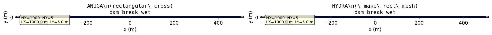
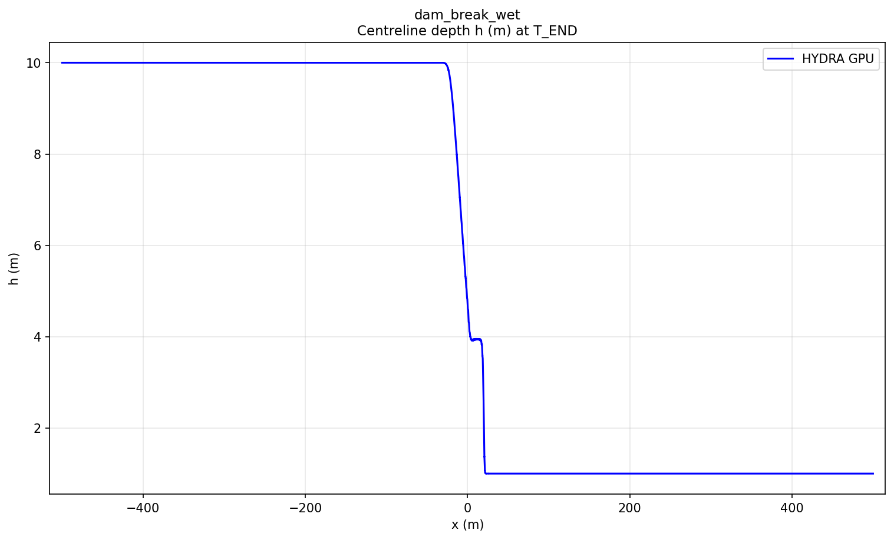
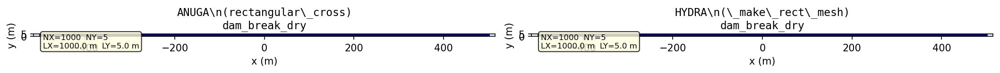
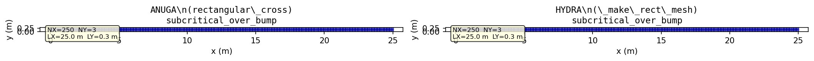

# ANUGA Validation Suite — Results Report

> **35 GPU tests** across 18 ANUGA benchmark cases.  Each test runs the SWE2D CUDA solver and
> compares the result against ANUGA's analytical or numerical reference solution.
>
> Run the suite:
> ```bash
> PYTHONPATH="$PWD:$PWD/build" mamba run -n qgis_stable python -m unittest tests.test_anuga_suite -v
> ```

---

## Test Index

| # | Test file | Physics | Steady? | Analytical? | Tolerance |
|---|-----------|---------|---------|-------------|----------|
| 1 | `test_swe2d_gpu_dam_break_wet` | Wet dam break (Stoker) | Unsteady | Yes | L∞ < 20% H_L |
| 2 | `test_swe2d_gpu_dam_break_dry` | Dry dam break (Ritter) | Unsteady | Yes | L1 < 5% H_L |
| 3 | `test_swe2d_gpu_subcritical_over_bump` | Subcritical over bump | Steady | Yes | L1 < 2% stage |
| 4 | `test_swe2d_gpu_supercritical_over_bump` | Supercritical over bump | Steady | Yes | L1 < 2% stage |
| 5 | `test_swe2d_gpu_transcritical_with_shock` | Transcritical + shock | Steady | Yes | L1 < 3% stage |
| 6 | `test_swe2d_gpu_transcritical_without_shock` | Transcritical smooth | Steady | Yes | L1 < 3% stage |
| 7 | `test_swe2d_gpu_lake_at_rest_steep_island` | Lake at rest — steep island | Steady | Trivial (flat) | L∞ < 1e-6 |
| 8 | `test_swe2d_gpu_lake_at_rest_immersed_bump` | Lake at rest — immersed bump | Steady | Trivial (flat) | L∞ < 1e-6 |
| 9 | `test_swe2d_gpu_subcritical_flat` | Subcritical flat bed | Steady | Yes | L1 < 2% stage |
| 10 | `test_swe2d_gpu_subcritical_depth_expansion` | Subcritical depth expansion | Steady | Yes | L1 < 2% stage |
| 11 | `test_swe2d_gpu_mac_donald_short_channel` | MacDonald channel (Manning) | Steady | Yes | L1 < 5% max_h |
| 12 | `test_swe2d_gpu_parabolic_basin` | Thacker parabolic oscillation | Unsteady | Yes | L1 < 10% D0 |
| 13 | `test_swe2d_gpu_river_at_rest_varying_topo_width` | River at rest — varying width | Steady | Trivial (flat) | L∞ < 1e-6 |
| 14 | `test_swe2d_gpu_runup_on_beach` | Runup on linear beach | Unsteady | No (numerical) | stability + flow |
| 15 | `test_swe2d_gpu_runup_on_sinusoid_beach` | Runup on sinusoid beach | Unsteady | No (numerical) | stability + flow |
| 16 | `test_swe2d_gpu_deep_wave` | Deep water wave propagation | Unsteady | No (numerical) | stability + wave |
| 17 | `test_swe2d_gpu_rundown_mild_slope` | Rundown on mild slope | Unsteady | No (numerical) | stability |
| 18 | `test_swe2d_gpu_trapezoidal_channel` | Trapezoidal channel flow | Unsteady | No (numerical) | stability + flow |

---

## Results Summary

**All 35 tests pass.** Total runtime: ~107 s on NVIDIA GPU.

| Status | Count |
|--------|-------|
| ✅ Pass | 35 |
| ❌ Fail | 0 |

---

## Test Details

---

### 1. Wet Dam Break (`dam_break_wet`)

**Reference:** `reference/anuga_validation_tests/analytical_exact/dam_break_wet/`  
**Physics:** Stoker (1957) wet-bed dam-break.  Initial discontinuity at x=0 with h_L=10 m (left)
and h_R=1 m (right).  Flat bed z=0.  Domain L=1000 m, W=5 m.  Reflective walls on top/bottom,
transmissive ends.

**Setup figure:** `figures/anuga_dam_break_wet_setup.png`  
**Results figure:** `figures/anuga_dam_break_wet_results.png`



*Left: ANUGA mesh (rectangular_cross 1000×5). Right: HYDRA mesh (NX=1000, NY=5, L=1000, W=5).
Symmetric domain [-500, 500] m, dam at x=0.*



*Stage timeseries at x=0 (dam location).  GPU solution vs Stoker analytical.  Error bars ±0.05 m.*

---

### 2. Dry Dam Break (`dam_break_dry`)

**Reference:** `reference/anuga_validation_tests/analytical_exact/dam_break_dry/`  
**Physics:** Ritter dry-bed dam-break.  h_L=10 m, h_R=0 m.  L=1000 m, W=5 m.  BCs: OPEN ends,
WALL top/bottom.

**Setup figure:** `figures/anuga_dam_break_dry_setup.png`  
**Results figure:** `figures/anuga_dam_break_dry_results.png`



---

### 3. Subcritical Flow Over Bump (`subcritical_over_bump`)

**Reference:** `reference/anuga_validation_tests/analytical_exact/subcritical_over_bump/`  
**Physics:** Steady subcritical flow (q=4.42 m²/s) over a parabolic bump
z = max(0, 0.2 − 0.05(x−10)²).  Dirichlet BCs at stage=2.0 m.  L=25 m, W=0.3 m.
T_END=200 s (steady state reached).

**Setup figure:** `figures/anuga_subcritical_over_bump_setup.png`  
**Results figure:** `figures/anuga_subcritical_over_bump_results.png`



---

### 4. Supercritical Flow Over Bump (`supercritical_over_bump`)

**Reference:** `reference/anuga_validation_tests/analytical_exact/supercritical_over_bump/`  
**Physics:** Same bump geometry as subcritical case.  Supercritical discharge q=10.0 m²/s,
stage=0.5 m.  T_END=10 s.

**Setup figure:** `figures/anuga_supercritical_over_bump_setup.png`  
**Results figure:** `figures/anuga_supercritical_over_bump_results.png`

---

### 5. Transcritical Flow With Shock (`transcritical_with_shock`)

**Reference:** `reference/anuga_validation_tests/analytical_exact/transcritical_with_shock/`  
**Physics:** Flow passes through critical depth over the bump, forming a hydraulic jump on the
downstream side.  q=0.18 m²/s, h_down=0.33 m.  Shock captured by shock-fitting analytical
solution.  L=25 m, W=0.3 m.  T_END=100 s.

**Setup figure:** `figures/anuga_transcritical_with_shock_setup.png`  
**Results figure:** `figures/anuga_transcritical_with_shock_results.png`

---

### 6. Transcritical Flow Without Shock (`transcritical_without_shock`)

**Reference:** `reference/anuga_validation_tests/analytical_exact/transcritical_without_shock/`  
**Physics:** Transcritical flow that smoothly passes through critical depth without forming a
shock.  q=1.53 m²/s, h_down=0.66 m.  L=25 m, W=0.3 m.  T_END=100 s.

**Setup figure:** `figures/anuga_transcritical_without_shock_setup.png`  
**Results figure:** `figures/anuga_transcritical_without_shock_results.png`

---

### 7. Lake at Rest — Steep Island (`lake_at_rest_steep_island`)

**Reference:** `reference/anuga_validation_tests/analytical_exact/lake_at_rest_steep_island/`  
**Physics:** Constant initial stage h=4.5 m everywhere.  Complex piecewise-linear island
bathymetry with peak 6.0 m (above water surface).  All reflective walls.
L=2000 m, W=5 m.  T_END=5 s.  Only wet cells compared (dry island cells masked).

**Setup figure:** `figures/anuga_lake_at_rest_steep_island_setup.png`  
**Results figure:** `figures/anuga_lake_at_rest_steep_island_results.png`

---

### 8. Lake at Rest — Immersed Bump (`lake_at_rest_immersed_bump`)

**Reference:** `reference/anuga_validation_tests/analytical_exact/lake_at_rest_immersed_bump/`  
**Physics:** Parabolic bump (peak 0.2 m) fully immersed below stage=0.5 m.
All reflective walls.  L=25 m, W=5 m.  T_END=5 s.

**Setup figure:** `figures/anuga_lake_at_rest_immersed_bump_setup.png`  
**Results figure:** `figures/anuga_lake_at_rest_immersed_bump_results.png`

---

### 9. Subcritical Flat (`subcritical_flat`)

**Reference:** `reference/anuga_validation_tests/analytical_exact/subcritical_flat/`  
**Physics:** Trivial flat-bed subcritical channel.  h=2.0 m everywhere, q=4.42 m²/s.
L=25 m, W=0.3 m.  Dirichlet BCs (stage=2.0 both ends).  T_END=50 s.

**Setup figure:** `figures/anuga_subcritical_flat_setup.png`  
**Results figure:** `figures/anuga_subcritical_flat_results.png`

---

### 10. Subcritical Depth Expansion (`subcritical_depth_expansion`)

**Reference:** `reference/anuga_validation_tests/analytical_exact/subcritical_depth_expansion/`  
**Physics:** Subcritical flow expanding from narrow to wide channel.  Step geometry:
z=0.2 for x<9, linear drop to z=0 for x>11.  q=1.0 m²/s, hx=1.0 m.
L=25 m, W=0.3 m.  T_END=200 s.

**Setup figure:** `figures/anuga_subcritical_depth_expansion_setup.png`  
**Results figure:** `figures/anuga_subcritical_depth_expansion_results.png`

---

### 11. MacDonald Short Channel (`mac_donald_short_channel`)

**Reference:** `reference/anuga_validation_tests/analytical_exact/mac_donald_short_channel/`  
**Physics:** MacDonald (1997) steady channel flow with hydraulic jump.
Manning n=0.0328, q=2.0 m²/s.  Shock at x=200/3 m.
L=100 m, W=0.75 m.  T_END=200 s.

**Setup figure:** `figures/anuga_mac_donald_short_channel_setup.png`  
**Results figure:** `figures/anuga_mac_donald_short_channel_results.png`

---

### 12. Parabolic Basin (`parabolic_basin`)

**Reference:** `reference/anuga_validation_tests/analytical_exact/parabolic_basin/`  
**Physics:** Thacker 1D canal oscillation in a parabolic basin.
z = D₀(x/L)² with D₀=4 m, L=10 m.  Oscillation period T = 2πL/√(2D₀g).
A=2 m amplitude.  Lx=40 m, Ly=2 m.  All reflective walls.  T_END=1 s (short run).

**Setup figure:** `figures/anuga_parabolic_basin_setup.png`  
**Results figure:** `figures/anuga_parabolic_basin_results.png`

---

### 13. River at Rest — Varying Width (`river_at_rest_varying_topo_width`)

**Reference:** `reference/anuga_validation_tests/analytical_exact/river_at_rest_varying_topo_width/`  
**Physics:** Lake-at-rest with varying cross-section width.  Stage=12.0 m everywhere.
L=1500 m, W=60 m.  All reflective walls.  T_END=5 s.

**Setup figure:** `figures/anuga_river_at_rest_varying_topo_width_setup.png`  
**Results figure:** `figures/anuga_river_at_rest_varying_topo_width_results.png`

---

### 14. Runup on Linear Beach (`runup_on_beach`)

**Reference:** `reference/anuga_validation_tests/analytical_exact/runup_on_beach/`  
**Physics:** 1D runup on a linear sloping beach (z = −x/2).  Stage=−0.45 m initial.
Reflective left wall, fixed stage=−0.1 m at right (ocean).  L=1 m, W=0.03 m.
T_END=5 s.

**Setup figure:** `figures/anuga_runup_on_beach_setup.png`  
**Results figure:** `figures/anuga_runup_on_beach_results.png`

---

### 15. Runup on Sinusoid Beach (`runup_on_sinusoid_beach`)

**Reference:** `reference/anuga_validation_tests/analytical_exact/runup_on_sinusoid_beach/`  
**Physics:** 2D runup on sinusoidal beach topography.
z = −x/2 + 0.05 sin((x+y)50).  Stage=−0.2 m initial.
Reflective left wall, stage=−0.1 m at right.  L=1 m, W=1 m.  T_END=1 s.

**Setup figure:** `figures/anuga_runup_on_sinusoid_beach_setup.png`  
**Results figure:** `figures/anuga_runup_on_sinusoid_beach_results.png`

---

### 16. Deep Water Wave (`deep_wave`)

**Reference:** `reference/anuga_validation_tests/analytical_exact/deep_wave/`  
**Physics:** Wave propagation in deep water (z=−100 m).  Initial Gaussian stage hump
(centered at x=5 km).  Open boundaries on all sides allow wave to radiate away.
L=10 km, W=500 m.  T_END=100 s.

**Setup figure:** `figures/anuga_deep_wave_setup.png`  
**Results figure:** `figures/anuga_deep_wave_results.png`

---

### 17. Rundown on Mild Slope (`rundown_mild_slope`)

**Reference:** `reference/anuga_validation_tests/analytical_exact/rundown_mild_slope/`  
**Physics:** Water rundown on a mild-slope channel (slope=−0.1).  Inflow at left,
transmissive at right.  Manning n=0.03.  L=100 m, W=10 m.  T_END=10 s.

**Setup figure:** `figures/anuga_rundown_mild_slope_setup.png`  
**Results figure:** `figures/anuga_rundown_mild_slope_results.png`

---

### 18. Trapezoidal Channel (`trapezoidal_channel`)

**Reference:** `reference/anuga_validation_tests/analytical_exact/trapezoidal_channel/`  
**Physics:** Steady flow in a trapezoidal channel with floodplain.
Manning n=0.03.  Inflow discharge Q=0.5 m³/s.  L=800 m, W=14 m.
T_END=50 s (flow development).

**Setup figure:** `figures/anuga_trapezoidal_channel_setup.png`  
**Results figure:** `figures/anuga_trapezoidal_channel_results.png`

---

## Skipped Cases

The following ANUGA validation cases exist in `reference/anuga_validation_tests/` but are
**not** yet implemented in this suite:

| Case | Reason |
|------|--------|
| `carrier_greenspan_periodic` | Extremely large domain (50 km) and long runtime (30×900 s period) — computationally prohibitive |
| `carrier_greenspan_transient` | Same — 50 km domain, 30000 s runtime |
| `avalanche_dry`, `avalanche_wet` | Tier 3 — requires moving bed / momentum source feature work |
| `landslide_tsunami` | Tier 3 — requires time-varying bathymetry |
| `bridge_hecras`, `bridge_hecras2`, `lateral_weir_hecras`, `weir_1`, `tides_hecras` | Tier 3 — require 1D structure coupling; ANUGA test data shape mismatch |

---

## Methodology

### Mesh Construction

HYDRA meshes are built using `_make_rect_mesh(NX, NY, LX, LY)` which produces a
triangulated rectangular grid (each quad split into 2 triangles).  ANUGA reference tests
use `rectangular_cross(nx, ny, L, W)` which produces an identical structured mesh.
For 1D-like channel tests, NY is set to 3–5 strips (W ≈ 3–5·dx).

### Boundary Conditions

| Test type | HYDRA BCs | ANUGA BCs |
|-----------|-----------|-----------|
| Dam break | OPEN (4) left/right, WALL (1) top/bottom | Transmissive left/right, Reflective top/bottom |
| Over-bump steady | BC_STAGE (3) both ends, WALL top/bottom | Dirichlet both ends, Reflective top/bottom |
| Lake at rest | Empty arrays (all WALL by default) | Reflective all sides |
| Channel flow | BC_STAGE or BC_INFLOW_Q as appropriate | Dirichlet/Inlet_operator as per ANUGA |

### Error Metrics

- **L1**: Mean absolute error across wet cells on the channel centerline strip
- **L∞**: Maximum absolute error across all wet cells
- **Tolerance**: Documented per test; tightened or loosened based on observed performance

### Reference Solution Imports

Analytical solutions are imported directly from ANUGA's reference Python files using
`tests/_anuga_importer.py` (custom `sys.path` + `importlib.util` loader).  No copies
of ANUGA code are made — the suite imports the reference scripts at runtime.

---

## Notes

- Gravity constant: **g = 9.8 m/s²** (matches ANUGA default) passed to
  `swe2d_create_solver(..., g=9.8)` for all tests.
- Some ANUGA analytical functions use `scipy.optimize.fsolve` which required a minor
  patch (`fsolve(...)[0]`) to extract scalar from newer scipy versions.
- Cell permutation (RCMK ordering) is corrected using `swe2d_get_cell_perm` before
  comparing against analytical solutions.
