# 2D Model GeoPackage Schema

## Overview

The 2D model GeoPackage stores the **input data** for a SWE2D simulation: the unstructured mesh topology, boundary conditions, Manning's *n* zones, rainfall/CN data, drainage network geometry, and hydraulic structures. It is the user-authored input file, typically created via the **Create 2D Model GeoPackage** button in the Map tab and then populated through the topology editor and layer digitising tools.

The file is a standard OGC GeoPackage (SQLite with spatial metadata). All 18 domain-specific tables are vector layers registered in `gpkg_contents` / `gpkg_geometry_columns`.

## OGC Metadata Tables

These three tables are required by the GeoPackage specification and are created automatically.

### `spatial_ref_sys`

| Column | Type | Description |
|---|---|---|
| `srs_id` | INTEGER PK | Spatial reference system ID |
| `srs_name` | TEXT NOT NULL | Human-readable name |
| `srs_type` | TEXT NOT NULL | `"geodetic"` / `"projected"` |
| `organization` | TEXT NOT NULL | e.g. `"EPSG"` |
| `organization_coordsys_id` | INTEGER NOT NULL | EPSG code |
| `definition` | TEXT NOT NULL | WKT definition |
| `description` | TEXT | Optional description |

A single row with `srs_id = 4326` (WGS 84) is inserted by default. The actual CRS is taken from the QGIS project CRS when the GeoPackage is created.

### `gpkg_contents`

| Column | Type | Description |
|---|---|---|
| `table_name` | TEXT NOT NULL PK | Table name |
| `data_type` | TEXT NOT NULL | `"features"` for spatial, `"attributes"` for non-spatial |
| `identifier` | TEXT | Human-readable identifier |
| `description` | TEXT DEFAULT '' | Description |
| `last_change` | DATETIME NOT NULL | Last modification timestamp |
| `min_x` | DOUBLE | Spatial extent min X |
| `min_y` | DOUBLE | Spatial extent min Y |
| `max_x` | DOUBLE | Spatial extent max X |
| `max_y` | DOUBLE | Spatial extent max Y |
| `srs_id` | INTEGER | FK → `spatial_ref_sys.srs_id` |

### `gpkg_geometry_columns`

| Column | Type | Description |
|---|---|---|
| `table_name` | TEXT NOT NULL | Table name (composite PK) |
| `column_name` | TEXT NOT NULL | Geometry column name (typically `"geom"`) |
| `geometry_type_name` | TEXT NOT NULL | `"POINT"`, `"LINESTRING"`, `"POLYGON"`, `"MULTIPOLYGON"`, etc. |
| `srs_id` | INTEGER NOT NULL | FK → `spatial_ref_sys.srs_id` |
| `z` | TINYINT NOT NULL | Has Z dimension (0 or 1) |
| `m` | TINYINT NOT NULL | Has M dimension (0 or 1) |
| CONSTRAINT | | `PRIMARY KEY (table_name, column_name)` |

## Domain Model Tables

### Topology

#### `swe2d_topo_nodes`

Point layer — seed nodes for mesh generation.

| Field | Type | Description |
|---|---|---|
| `geom` | POINT | Node location |
| `node_id` | INTEGER | Unique node identifier |

#### `swe2d_topo_arcs`

LineString layer — topological arcs defining mesh boundaries and internal breaklines.

| Field | Type | Description |
|---|---|---|
| `geom` | LINESTRING | Arc geometry |
| `arc_id` | INTEGER | Unique arc identifier |
| `node0` | INTEGER | Start node ID |
| `node1` | INTEGER | End node ID |
| `use_global_arc_ctrl` | INTEGER | Flag: use global arc control settings |
| `arc_mode_override` | TEXT(24) | Meshing mode override |
| `arc_soft_size_override` | DOUBLE | Soft size constraint override |
| `arc_soft_dist_override` | DOUBLE | Soft distance constraint override |

#### `swe2d_topo_regions`

Polygon layer — mesh refinement regions.

| Field | Type | Description |
|---|---|---|
| `geom` | POLYGON / MULTIPOLYGON | Region boundary |
| `region_id` | INTEGER | Unique region identifier |
| `target_size` | DOUBLE | Target element size in this region |
| `cell_type` | TEXT(32) | Cell type hint |
| `edge_len_1` | DOUBLE | Edge length parameter 1 |
| `edge_len_2` | DOUBLE | Edge length parameter 2 |
| `edge_len_3` | DOUBLE | Edge length parameter 3 |
| `edge_len_4` | DOUBLE | Edge length parameter 4 |

#### `swe2d_topo_constraints`

Polygon layer — hard constraints for mesh generation (e.g. holes, refinement zones).

| Field | Type | Description |
|---|---|---|
| `geom` | POLYGON / MULTIPOLYGON | Constraint boundary |
| `constraint_id` | INTEGER | Unique constraint identifier |
| `target_size` | DOUBLE | Target element size |
| `cell_type` | TEXT(32) | Cell type hint |
| `edge_len_1` | DOUBLE | Edge length parameter 1 |
| `edge_len_2` | DOUBLE | Edge length parameter 2 |
| `edge_len_3` | DOUBLE | Edge length parameter 3 |
| `edge_len_4` | DOUBLE | Edge length parameter 4 |

#### `swe2d_topo_quad_edges`

LineString layer — edges where quadrilateral boundary layers are desired.

| Field | Type | Description |
|---|---|---|
| `geom` | LINESTRING | Edge geometry |
| `region_id` | INTEGER | Associated region |
| `edge_id` | INTEGER | Edge identifier |
| `target_size` | DOUBLE | Target element size |
| `n_layers` | INTEGER | Number of quad layers |
| `first_height` | DOUBLE | First layer height |
| `growth_rate` | DOUBLE | Layer growth rate |

### Material / Friction

#### `swe2d_manning_zones`

Polygon layer — Manning's *n* roughness zones.

| Field | Type | Description |
|---|---|---|
| `geom` | POLYGON / MULTIPOLYGON | Zone boundary |
| `zone_id` | INTEGER | Unique zone identifier |
| `n_mann` | DOUBLE | Manning's *n* value |
| `priority` | INTEGER | Overlap priority (higher = wins) |

### Boundary Conditions

#### `swe2d_bc_lines`

LineString layer — boundary condition segments along the mesh perimeter.

| Field | Type | Description |
|---|---|---|
| `geom` | LINESTRING | BC segment geometry |
| `bc_type` | INTEGER | Boundary condition type code |
| `bc_value` | DOUBLE | BC value (stage, flow, etc.) |
| `priority` | INTEGER | Overlap priority |
| `hydrograph` | TEXT(1024) | Hydrograph definition (inline) |
| `hydrograph_id` | TEXT(64) | FK → hydrograph table |
| `hydrograph_layer` | TEXT(128) | Source hydrograph layer name |

### Sample / Monitoring

#### `swe2d_sample_lines`

LineString layer — cross-section sample lines for time-series and profile output.

| Field | Type | Description |
|---|---|---|
| `geom` | LINESTRING | Sample line geometry |
| `line_id` | INTEGER | Unique line identifier |
| `name` | TEXT(128) | Display name |
| `enabled` | INTEGER | Flag: enabled for sampling (0/1) |
| `priority` | INTEGER | Display / overlap priority |

### Rainfall / Infiltration

#### `swe2d_rain_gages`

Point layer — rain gauge locations.

| Field | Type | Description |
|---|---|---|
| `geom` | POINT | Gauge location |
| `gage_id` | TEXT(64) | Unique gauge identifier |
| `name` | TEXT(128) | Display name |
| `hyetograph_id` | TEXT(64) | FK → `swe2d_hyetographs.hyetograph_id` |
| `units` | TEXT(32) | Units (e.g. `"mm/hr"`, `"in/hr"`) |
| `priority` | INTEGER | Overlap priority |

#### `swe2d_storm_areas`

Polygon layer — storm/rainfall polygon areas.

| Field | Type | Description |
|---|---|---|
| `geom` | POLYGON / MULTIPOLYGON | Storm area boundary |
| `storm_id` | INTEGER | Unique storm identifier |
| `name` | TEXT(128) | Display name |
| `priority` | INTEGER | Overlap priority |

#### `swe2d_cn_zones`

Polygon layer — Curve Number (CN) infiltration zones.

| Field | Type | Description |
|---|---|---|
| `geom` | POLYGON / MULTIPOLYGON | CN zone boundary |
| `zone_id` | INTEGER | Unique zone identifier |
| `cn` | DOUBLE | Curve Number value (30–100) |
| `priority` | INTEGER | Overlap priority |

### Time-Series Definitions (non-spatial, no geometry column)

#### `swe2d_hyetographs`

Attribute table — hyetograph (rainfall intensity) time series definitions.

| Field | Type | Description |
|---|---|---|
| `hyetograph_id` | TEXT(64) | Unique hyetograph identifier |
| `Time` | TEXT(32) | Time value or offset |
| `Value` | DOUBLE | Intensity value |
| `value_type` | TEXT(24) | Value type (e.g. `"intensity"`) |
| `units` | TEXT(24) | Units (e.g. `"mm/hr"`) |
| `description` | TEXT(256) | Optional description |

#### `swe2d_hydrographs`

Attribute table — hydrograph (flow / stage) time series for boundary conditions.

| Field | Type | Description |
|---|---|---|
| `hydrograph_id` | TEXT(64) | Unique hydrograph identifier |
| `bc_type` | INTEGER | Boundary condition type code |
| `Time` | TEXT(32) | Time value or offset |
| `Value` | DOUBLE | Flow / stage value |
| `description` | TEXT(256) | Optional description |

### Drainage Network

#### `swe2d_drainage_nodes`

Point layer — drainage network nodes (manholes, junctions, outfalls).

| Field | Type | Description |
|---|---|---|
| `geom` | POINT | Node location |
| `node_id` | TEXT(64) | Unique node identifier |
| `invert_elev` | DOUBLE | Invert elevation |
| `max_depth` | DOUBLE | Maximum depth |
| `rim_elev` | DOUBLE | Rim elevation |
| `crest_elev` | DOUBLE | Crest elevation |
| `node_type` | TEXT(32) | Node type (e.g. `"JUNCTION"`, `"OUTFALL"`) |
| `surface_area` | DOUBLE | Ponded surface area |
| `outfall_area` | DOUBLE | Outfall receiving area |
| `zero_storage` | INTEGER | Flag: zero-storage node (0/1) |

#### `swe2d_drainage_links`

LineString layer — drainage network links (pipes, channels).

| Field | Type | Description |
|---|---|---|
| `geom` | LINESTRING | Link geometry |
| `link_id` | TEXT(64) | Unique link identifier |
| `from_node` | TEXT(64) | FK → `swe2d_drainage_nodes.node_id` |
| `to_node` | TEXT(64) | FK → `swe2d_drainage_nodes.node_id` |
| `link_type` | TEXT(32) | Link type (e.g. `"CONDUIT"`, `"CHANNEL"`) |
| `link_shape` | TEXT(32) | Cross-section shape (e.g. `"CIRCULAR"`, `"RECT_OPEN"`) |
| `length` | DOUBLE | Link length |
| `roughness_n` | DOUBLE | Manning's *n* for the link |
| `diameter` | DOUBLE | Diameter (circular) |
| `span` | DOUBLE | Span (rectangular / irregular) |
| `rise` | DOUBLE | Rise (rectangular / irregular) |
| `area_m2` | DOUBLE | Cross-sectional area (m²) |
| `equiv_diameter_m` | DOUBLE | Equivalent diameter (m) |
| `max_flow` | DOUBLE | Maximum flow capacity |
| `cd` | DOUBLE | Discharge coefficient |

#### `swe2d_drainage_inlets`

Attribute table — inlet type definitions (non-spatial).

| Field | Type | Description |
|---|---|---|
| `inlet_type_id` | TEXT(64) | Unique inlet type identifier |
| `name` | TEXT(128) | Display name |
| `weir_length` | DOUBLE | Weir length |
| `orifice_area` | DOUBLE | Orifice area |
| `coeff_weir` | DOUBLE | Weir coefficient |
| `coeff_orifice` | DOUBLE | Orifice coefficient |
| `max_capture` | DOUBLE | Maximum capture rate |
| `description` | TEXT(256) | Optional description |

#### `swe2d_drainage_node_inlets`

Attribute table — node-to-inlet assignment (non-spatial).

| Field | Type | Description |
|---|---|---|
| `node_id` | TEXT(64) | FK → `swe2d_drainage_nodes.node_id` |
| `inlet_type_id` | TEXT(64) | FK → `swe2d_drainage_inlets.inlet_type_id` |
| `inlet_count` | DOUBLE | Number of inlets at this node |
| `crest_offset` | DOUBLE | Crest offset |
| `description` | TEXT(256) | Optional description |

### Hydraulic Structures

#### `swe2d_structures`

LineString layer — hydraulic structures (weirs, orifices, culverts, bridges, pumps, dams).

| Field | Type | Description |
|---|---|---|
| `geom` | LINESTRING | Structure alignment |
| `structure_id` | TEXT(64) | Unique structure identifier |
| `structure_type` | INTEGER | Type code (0=weir, 1=orifice, 2=culvert, 3=bridge, 4=pump, etc.) |
| `crest_elev` | DOUBLE | Crest / sill elevation |
| `enabled` | INTEGER | Flag: enabled (0/1) |
| `width` | DOUBLE | Structure width |
| `height` | DOUBLE | Structure height |
| `diameter` | DOUBLE | Diameter (circular structures) |
| `culvert_shape` | TEXT(32) | Culvert cross-section shape |
| `culvert_code` | INTEGER | Culvert HDS-5 code |
| `culvert_rise` | DOUBLE | Culvert rise |
| `culvert_span` | DOUBLE | Culvert span |
| `culvert_area_m2` | DOUBLE | Culvert full-flow area (m²) |
| `culvert_barrels` | INTEGER | Number of barrels |
| `culvert_slope` | DOUBLE | Culvert slope |
| `inlet_invert_elev` | DOUBLE | Inlet invert elevation |
| `outlet_invert_elev` | DOUBLE | Outlet invert elevation |
| `entrance_loss_k` | DOUBLE | Entrance loss coefficient |
| `exit_loss_k` | DOUBLE | Exit loss coefficient |
| `embankment_enabled` | INTEGER | Flag: embankment overflow enabled |
| `embankment_crest_elev` | DOUBLE | Embankment crest elevation |
| `embankment_overflow_width` | DOUBLE | Embankment overflow width |
| `embankment_weir_coeff` | DOUBLE | Embankment weir coefficient |
| `length` | DOUBLE | Structure length |
| `roughness_n` | DOUBLE | Manning's *n* |
| `coeff` | DOUBLE | Generic coefficient |
| `cd` | DOUBLE | Discharge coefficient |
| `opening` | DOUBLE | Orifice opening fraction |
| `q_pump` | DOUBLE | Pump flow rate |
| `max_flow` | DOUBLE | Maximum flow capacity |
| `inlet_loss_k` | DOUBLE | Inlet loss coefficient |
| `outlet_loss_k` | DOUBLE | Outlet loss coefficient |
| `stacked_enabled` | INTEGER | Flag: stacked rating curve |
| `use_redistribution` | INTEGER | Flag: flow redistribution |
| `influence_width` | DOUBLE | Flow redistribution influence width |
| `upstream_buffer` | DOUBLE | Upstream buffer distance |
| `downstream_buffer` | DOUBLE | Downstream buffer distance |
| `deck_soffit_elev` | DOUBLE | Bridge deck soffit elevation |
| `deck_top_elev` | DOUBLE | Bridge deck top elevation |
| `model_top_elev` | DOUBLE | Bridge model top elevation |
| `under_layers` | INTEGER | Bridge under-clearance layers |
| `over_layers` | INTEGER | Bridge overtopping layers |
| `pier_count` | INTEGER | Number of bridge piers |
| `pier_width` | DOUBLE | Bridge pier width |

## Entity Relationship Diagram

```mermaid
erDiagram
    swe2d_topo_nodes ||--o{ swe2d_topo_arcs : "arc endpoints"
    swe2d_drainage_nodes ||--o{ swe2d_drainage_links : "from_node"
    swe2d_drainage_nodes ||--o{ swe2d_drainage_links : "to_node"
    swe2d_drainage_nodes ||--o{ swe2d_drainage_node_inlets : "node_id"
    swe2d_drainage_inlets ||--o{ swe2d_drainage_node_inlets : "inlet_type_id"
    swe2d_hyetographs ||--o{ swe2d_rain_gages : "hyetograph_id"
    swe2d_hydrographs ||--o{ swe2d_bc_lines : "hydrograph_id"

    swe2d_topo_nodes {
        integer node_id PK
        point geom
    }
    swe2d_topo_arcs {
        integer arc_id PK
        integer node0 FK
        integer node1 FK
        linestring geom
    }
    swe2d_topo_regions {
        integer region_id PK
        polygon geom
    }
    swe2d_topo_constraints {
        integer constraint_id PK
        polygon geom
    }
    swe2d_topo_quad_edges {
        integer edge_id
        linestring geom
    }
    swe2d_manning_zones {
        integer zone_id PK
        double n_mann
        polygon geom
    }
    swe2d_bc_lines {
        integer bc_type
        double bc_value
        linestring geom
    }
    swe2d_sample_lines {
        integer line_id PK
        linestring geom
    }
    swe2d_rain_gages {
        string gage_id PK
        point geom
    }
    swe2d_storm_areas {
        integer storm_id PK
        polygon geom
    }
    swe2d_cn_zones {
        integer zone_id PK
        double cn
        polygon geom
    }
    swe2d_hyetographs {
        string hyetograph_id PK
        string Time
        double Value
    }
    swe2d_hydrographs {
        string hydrograph_id PK
        string Time
        double Value
    }
    swe2d_drainage_nodes {
        string node_id PK
        point geom
    }
    swe2d_drainage_links {
        string link_id PK
        string from_node FK
        string to_node FK
        linestring geom
    }
    swe2d_drainage_inlets {
        string inlet_type_id PK
    }
    swe2d_drainage_node_inlets {
        string node_id FK
        string inlet_type_id FK
    }
    swe2d_structures {
        string structure_id PK
        linestring geom
    }
```

## Layer Summary

| # | Table Name | Geometry Type | Domain |
|---|---|---|---|
| 1 | `swe2d_topo_nodes` | POINT | Mesh topology |
| 2 | `swe2d_topo_arcs` | LINESTRING | Mesh topology |
| 3 | `swe2d_topo_regions` | (MULTI)POLYGON | Mesh topology |
| 4 | `swe2d_topo_constraints` | (MULTI)POLYGON | Mesh topology |
| 5 | `swe2d_topo_quad_edges` | LINESTRING | Mesh topology |
| 6 | `swe2d_manning_zones` | (MULTI)POLYGON | Material / friction |
| 7 | `swe2d_bc_lines` | LINESTRING | Boundary conditions |
| 8 | `swe2d_sample_lines` | LINESTRING | Monitoring |
| 9 | `swe2d_rain_gages` | POINT | Rainfall |
| 10 | `swe2d_storm_areas` | (MULTI)POLYGON | Rainfall |
| 11 | `swe2d_cn_zones` | (MULTI)POLYGON | Infiltration |
| 12 | `swe2d_hyetographs` | *(none)* | Time series |
| 13 | `swe2d_hydrographs` | *(none)* | Time series |
| 14 | `swe2d_drainage_nodes` | POINT | Drainage network |
| 15 | `swe2d_drainage_links` | LINESTRING | Drainage network |
| 16 | `swe2d_drainage_inlets` | *(none)* | Drainage network |
| 17 | `swe2d_drainage_node_inlets` | *(none)* | Drainage network |
| 18 | `swe2d_structures` | LINESTRING | Hydraulic structures |

## Key Constraints & Conventions

- **CRS**: The project CRS at creation time is stored in `spatial_ref_sys` with `srs_id = 4326`. All geometry columns reference this SRS through `gpkg_geometry_columns`.
- **Field naming**: All field names use `snake_case`. Units are **model units** (SI or USC as defined by the project CRS).
- **No foreign key enforcement**: SQLite does not enforce FK constraints by default. Cross-table references (e.g. `hydrograph_id` on `swe2d_bc_lines` → `swe2d_hydrographs`) are logical references maintained by application code.
- **All layers are created empty**: The user populates them through the QGIS digitising workflow or topology editor.
