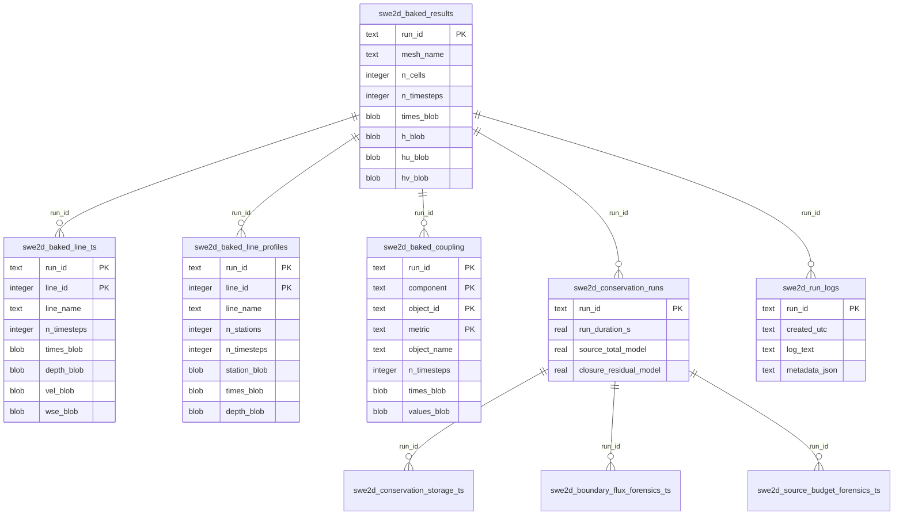

# Results GeoPackage Schema

## Overview

SWE2D simulation results are stored in the same GeoPackage (`.gpkg`) as the
input model. Every run produces structured tables organised by domain:

- **Mesh results** — cell-centred depth and momentum at each snapshot timestep (BLOB format)
- **Line results** — time-series and cross-section profiles at user-specified sample lines (BLOB format)
- **Coupling results** — drainage network and hydraulic structure flows (BLOB format)
- **Run logs** — text logs and metadata for each simulation run
- **Conservation forensics** — water budget, boundary flux accounting, and closure residuals

A single GeoPackage can hold many runs. Each run is identified by a unique `run_id` string.

## BLOB Storage Format

All result data is stored as flat BLOBs (raw `numpy.ndarray.tobytes()`). This
is significantly more compact and faster to read/write than per-cell row
storage. Arrays are deserialized via `np.frombuffer()` on load — no lossy
conversion.

## Mesh Results

### `swe2d_baked_results`

One row per run. Contains all snapshot timesteps as flat BLOBs.

| Column | Type | Description |
|--------|------|-------------|
| `run_id` | TEXT PK | Unique run identifier |
| `mesh_name` | TEXT | Name of the mesh used for this run |
| `n_cells` | INTEGER | Number of mesh cells |
| `n_timesteps` | INTEGER | Number of snapshot timesteps |
| `created_utc` | TEXT | ISO-8601 timestamp (UTC) |
| `times_blob` | BLOB | `float64[]` — snapshot times in model seconds |
| `h_blob` | BLOB | `float64[]` — water depth, flattened `(n_timesteps × n_cells)` |
| `hu_blob` | BLOB | `float64[]` — x-momentum, flattened |
| `hv_blob` | BLOB | `float64[]` — y-momentum, flattened |
| `max_h_blob` | BLOB | `float64[]` — per-cell max depth (optional, for tracking) |
| `max_hu_blob` | BLOB | `float64[]` — per-cell max x-momentum (optional) |
| `max_hv_blob` | BLOB | `float64[]` — per-cell max y-momentum (optional) |

**Notes**:
- Only cells with `h > 0` at any timestep are stored (dry cells omitted).
- The `max_*` blobs are populated when max-tracking is enabled in solver options.

## Sample Line Results

### `swe2d_baked_line_ts`

One row per run per sample line. Contains bulk timeseries as flat BLOBs.

| Column | Type | Description |
|--------|------|-------------|
| `run_id` | TEXT | FK — run identifier |
| `line_id` | INTEGER | FK → `swe2d_sample_lines.line_id` |
| `line_name` | TEXT | Display name of the sample line |
| `n_timesteps` | INTEGER | Number of sampling timesteps |
| `times_blob` | BLOB | `float64[]` — sampling times |
| `depth_blob` | BLOB | `float64[]` — mean water depth |
| `vel_blob` | BLOB | `float64[]` — mean flow velocity |
| `wse_blob` | BLOB | `float64[]` — mean water surface elevation |
| `bed_blob` | BLOB | `float64[]` — mean bed elevation |
| `flow_blob` | BLOB | `float64[]` — total cross-section flow |
| `wet_frac_blob` | BLOB | `float64[]` — fraction of line that is wet (0–1) |
| `fr_blob` | BLOB | `float64[]` — mean Froude number |
| | | **PRIMARY KEY** `(run_id, line_id)` |

### `swe2d_baked_line_profiles`

One row per run per sample line. Contains 2D cross-section profiles (time × station).

| Column | Type | Description |
|--------|------|-------------|
| `run_id` | TEXT | FK — run identifier |
| `line_id` | INTEGER | FK → `swe2d_sample_lines.line_id` |
| `line_name` | TEXT | Display name |
| `n_stations` | INTEGER | Number of stations along the line |
| `n_timesteps` | INTEGER | Number of profile snapshots |
| `station_blob` | BLOB | `float64[]` — station distances along the line |
| `times_blob` | BLOB | `float64[]` — snapshot times |
| `depth_blob` | BLOB | `float64[]` — depth at each (time, station), flattened row-major |
| `vel_blob` | BLOB | `float64[]` — velocity at each (time, station) |
| `wse_blob` | BLOB | `float64[]` — WSE at each (time, station) |
| `bed_blob` | BLOB | `float64[]` — bed elevation at each (time, station) |
| `flow_qn_blob` | BLOB | `float64[]` — normal flow at each (time, station) |
| `fr_blob` | BLOB | `float64[]` — Froude number at each (time, station) |
| `wet_blob` | BLOB | `int32[]` — wet flag at each (time, station) |
| | | **PRIMARY KEY** `(run_id, line_id)` |

## Coupling Results

### `swe2d_baked_coupling`

One row per run per component/object/metric combination.

| Column | Type | Description |
|--------|------|-------------|
| `run_id` | TEXT | FK — run identifier |
| `component` | TEXT | Domain: `"drainage_node"`, `"drainage_link"`, `"structure"`, etc. |
| `object_id` | TEXT | Object identifier (node/link/structure ID) |
| `object_name` | TEXT | Display name |
| `metric` | TEXT | Measured metric: `"depth"`, `"flow"`, `"head"`, etc. |
| `n_timesteps` | INTEGER | Number of coupling timesteps |
| `times_blob` | BLOB | `float64[]` — coupling times |
| `values_blob` | BLOB | `float64[]` — metric values (model units) |
| | | **PRIMARY KEY** `(run_id, component, object_id, metric)` |

## Run Logs

### `swe2d_run_logs`

| Column | Type | Description |
|--------|------|-------------|
| `run_id` | TEXT PK | Unique run identifier |
| `created_utc` | TEXT | ISO-8601 timestamp |
| `start_wallclock` | TEXT | Wall-clock start time |
| `end_wallclock` | TEXT | Wall-clock end time |
| `duration_s` | REAL | Wall-clock duration (seconds) |
| `log_text` | TEXT | Full text of the run log |
| `metadata_json` | TEXT | JSON-encoded metadata dict |

## Conservation Forensics

### `swe2d_conservation_runs`

| Column | Type | Description |
|--------|------|-------------|
| `run_id` | TEXT PK | Unique run identifier |
| `created_utc` | TEXT | ISO-8601 timestamp |
| `run_duration_s` | REAL | Total run duration (model seconds) |
| `source_rain_model` | REAL | Total rain volume (model units³) |
| `source_cell_model` | REAL | Total cell source volume (model units³) |
| `source_coupling_model` | REAL | Total coupling source volume (model units³) |
| `source_total_model` | REAL | Total source volume (model units³) |
| `storage_start_model` | REAL | Storage at start (model units³) |
| `storage_end_model` | REAL | Storage at end (model units³) |
| `storage_delta_model` | REAL | Storage change (model units³) |
| `implied_net_boundary_out_model` | REAL | Implied net boundary outflow (model units³) |
| `closure_residual_model` | REAL | source − storageΔ − boundary (model units³) |
| `*_m3` / `*_cms` columns | REAL | SI equivalents of the above |

### `swe2d_conservation_storage_ts`

| Column | Type | Description |
|--------|------|-------------|
| `run_id` | TEXT | FK |
| `t_s` | REAL | Simulation time |
| `storage_model` | REAL | Total storage volume |
| `storage_delta_model` | REAL | Storage change since previous step |
| | | **PRIMARY KEY** `(run_id, t_s)` |

### `swe2d_boundary_flux_forensics_ts`

| Column | Type | Description |
|--------|------|-------------|
| `run_id` | TEXT | FK |
| `t_s` | REAL | Simulation time |
| `group_name` | TEXT | Boundary group identifier |
| `q_requested_model` | REAL | Requested flow (model units³/s) |
| `q_effective_model` | REAL | Effective applied flow |
| `vol_requested_model` | REAL | Cumulative requested volume |
| `vol_effective_model` | REAL | Cumulative effective volume |
| | | **PRIMARY KEY** `(run_id, t_s, group_name)` |

### `swe2d_source_budget_forensics_ts`

| Column | Type | Description |
|--------|------|-------------|
| `run_id` | TEXT | FK |
| `t_s` | REAL | Simulation time |
| `rain_vol_model` | REAL | Cumulative rain volume |
| `cell_vol_model` | REAL | Cumulative cell source volume |
| `coupling_vol_model` | REAL | Cumulative coupling volume |
| `source_total_vol_model` | REAL | Total source volume |
| | | **PRIMARY KEY** `(run_id, t_s)` |

## Other Tables

### `swe2d_baked_mesh`

| Column | Type | Description |
|--------|------|-------------|
| `mesh_name` | TEXT PK | Mesh identifier |
| `n_nodes` | INTEGER | Number of mesh nodes |
| `n_cells` | INTEGER | Number of mesh cells |
| `n_edges` | INTEGER | Number of mesh edges |
| `crs_wkt` | TEXT | CRS in WKT format |
| `baked_blob` | BLOB | Serialized mesh data |

### `swe2d_simulation_configs`

| Column | Type | Description |
|--------|------|-------------|
| `config_id` | TEXT PK | Configuration identifier |
| `mesh_name` | TEXT | Associated mesh name |
| `created_utc` | TEXT | ISO-8601 timestamp |
| `run_duration_s` | REAL | Run duration |
| `description` | TEXT | User description |
| `widget_state` | TEXT | JSON-serialized widget state |

## Entity Relationship Diagram

## Key Design Properties

| Property | Description |
|----------|-------------|
| **Shared schema** | All runs share the same tables, distinguished by `run_id`. No per-run DDL needed. |
| **BLOB storage** | All array data stored as flat BLOBs via `numpy.tobytes()`. Compact and fast. |
| **Units** | `_model`-suffixed columns use the project's native unit system (SI or USC). `_m3`/`_cms` columns are always SI. |
| **Product keys** | Every result table has a composite primary key that includes `run_id` to guarantee idempotency. |
| **Idempotent writes** | All persistence uses `INSERT OR REPLACE`, so re-running overwrites cleanly. |
