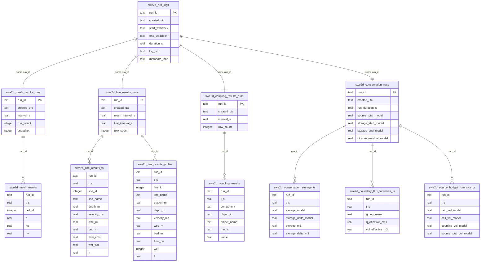

# Results GeoPackage Schema

## Overview

SWE2D simulation results are stored in one or more GeoPackage (`.gpkg`) files. Every run produces structured tables organised by domain:

- **Mesh results** — cell-centred depth and momentum at each snapshot timestep
- **Line results** — time-series and cross-section profiles at user-specified sample lines
- **Coupling results** — drainage network and hydraulic structure flows at each coupling step
- **Conservation forensics** — water budget, boundary flux accounting, and closure residuals
- **Run logs** — text logs and metadata for each simulation run

A single GeoPackage can hold many runs. Each run is identified by a unique `run_id` string.

## Run Registry Tables

Every result group has a companion *runs* metadata table that acts as a registry for that domain.

### `swe2d_mesh_results_runs`

| Column | Type | Description |
|---|---|---|
| `run_id` | TEXT PK | Unique run identifier |
| `created_utc` | TEXT | ISO-8601 timestamp (UTC) |
| `interval_s` | REAL | Snapshot interval in model seconds |
| `row_count` | INTEGER | Number of mesh snapshot rows written |
| `snapshot` | INTEGER | Flag: 1 = quick snapshot, 0 = full run (added by migration) |

### `swe2d_line_results_runs`

| Column | Type | Description |
|---|---|---|
| `run_id` | TEXT PK | Unique run identifier |
| `created_utc` | TEXT | ISO-8601 timestamp |
| `mesh_interval_s` | REAL | Mesh snapshot interval (s) |
| `line_interval_s` | REAL | Line sampling interval (s) |
| `row_count` | INTEGER | Number of time-series rows |
| `snapshot` | INTEGER | Flag: 1 = quick snapshot (added by migration) |

### `swe2d_coupling_results_runs`

| Column | Type | Description |
|---|---|---|
| `run_id` | TEXT PK | Unique run identifier |
| `created_utc` | TEXT | ISO-8601 timestamp |
| `interval_s` | REAL | Coupling output interval (s) |
| `row_count` | INTEGER | Number of coupling result rows |
| `snapshot` | INTEGER | Flag: 1 = quick snapshot (added by migration) |

### `swe2d_conservation_runs`

| Column | Type | Description |
|---|---|---|
| `run_id` | TEXT PK | Unique run identifier |
| `created_utc` | TEXT | ISO-8601 timestamp |
| `run_duration_s` | REAL | Total run duration (model seconds) |
| `source_rain_model` | REAL | Total rain volume (model units³) |
| `source_cell_model` | REAL | Total cell source volume (model units³) |
| `source_coupling_model` | REAL | Total coupling source volume (model units³) |
| `source_total_model` | REAL | Total source volume (model units³) |
| `storage_start_model` | REAL | Storage volume at start (model units³) |
| `storage_end_model` | REAL | Storage volume at end (model units³) |
| `storage_delta_model` | REAL | Storage change (model units³) |
| `implied_net_boundary_out_model` | REAL | Implied net boundary outflow (model units³) |
| `avg_implied_boundary_q_model` | REAL | Average implied boundary flow (model units³/s) |
| `boundary_group_volume_sum_model` | REAL | Sum of per-group boundary volumes (model units³) |
| `source_total_m3` | REAL | Total source volume (m³) |
| `storage_start_m3` | REAL | Storage at start (m³) |
| `storage_end_m3` | REAL | Storage at end (m³) |
| `storage_delta_m3` | REAL | Storage change (m³) |
| `implied_net_boundary_out_m3` | REAL | Implied net boundary outflow (m³) |
| `avg_implied_boundary_q_cms` | REAL | Average implied boundary flow (cms) |
| `boundary_group_volume_sum_m3` | REAL | Sum of per-group boundary volumes (m³) |
| `boundary_face_flux_table` | TEXT | Face flux table used, if any |
| `boundary_face_flux_status` | TEXT | `"ok"`, `"table_not_found"`, or status message |
| `boundary_face_flux_rows` | INTEGER | Number of boundary face flux rows |
| `boundary_face_flux_total_model` | REAL | Total boundary face flux (model units³) |
| `boundary_face_flux_total_cms` | REAL | Total boundary face flux (cms) |
| `effective_net_boundary_method` | TEXT | Method used for effective boundary |
| `effective_net_boundary_out_model` | REAL | Effective net boundary outflow (model units³) |
| `effective_net_boundary_out_m3` | REAL | Effective net boundary outflow (m³) |
| `effective_avg_q_model` | REAL | Effective average flow (model units³/s) |
| `effective_avg_q_cms` | REAL | Effective average flow (cms) |
| `closure_residual_model` | REAL | Closure residual = source − storageΔ − boundary (model units³) |
| `closure_residual_m3` | REAL | Closure residual (m³) |

## Mesh Results

### `swe2d_mesh_results`

| Column | Type | Description |
|---|---|---|
| `run_id` | TEXT | FK → `swe2d_mesh_results_runs.run_id` |
| `t_s` | REAL | Simulation time (model seconds) |
| `cell_id` | INTEGER | Cell index (0‑based, matches mesh data) |
| `h` | REAL | Water depth (model units) |
| `hu` | REAL | X‑momentum (model units²/s) |
| `hv` | REAL | Y‑momentum (model units²/s) |
| | | **PRIMARY KEY** `(run_id, t_s, cell_id)` |

**Notes**:
- Only cells with `h > 0` are persisted (dry cells are omitted).
- The `h`, `hu`, `hv` values represent **cell-centred** data interpolated from the solver.
- An index exists on `(run_id, t_s, cell_id)` for efficient per-run, per-timestep queries.

## Sample Line Results

### `swe2d_line_results_ts`

Time-series of bulk statistics for each sample line at each sampling timestep.

| Column | Type | Description |
|---|---|---|
| `run_id` | TEXT | FK → `swe2d_line_results_runs.run_id` |
| `t_s` | REAL | Simulation time (model seconds) |
| `line_id` | INTEGER | FK → `swe2d_sample_lines.line_id` |
| `line_name` | TEXT | Display name of the sample line |
| `depth_m` | REAL | Mean water depth along the line (model units) |
| `velocity_ms` | REAL | Mean flow velocity along the line (model units/s) |
| `wse_m` | REAL | Mean water surface elevation (model units) |
| `bed_m` | REAL | Mean bed elevation along the line (model units) |
| `flow_cms` | REAL | Total flow through the cross-section (model units³/s) |
| `wet_frac` | REAL | Fraction of the line that is wet (0–1) |
| `fr` | REAL | Mean Froude number |
| | | **PRIMARY KEY** `(run_id, t_s, line_id)` |

**Index**: `(run_id, line_id, t_s)` for fast per-line lookups.

### `swe2d_line_results_profile`

Full cross-section profile at each sample line at each timestep — per-station values along the line.

| Column | Type | Description |
|---|---|---|
| `run_id` | TEXT | FK → `swe2d_line_results_runs.run_id` |
| `t_s` | REAL | Simulation time (model seconds) |
| `line_id` | INTEGER | FK → `swe2d_sample_lines.line_id` |
| `line_name` | TEXT | Display name |
| `station_m` | REAL | Station distance along the line (model units) |
| `depth_m` | REAL | Water depth at this station (model units) |
| `velocity_ms` | REAL | Flow velocity at this station (model units/s) |
| `wse_m` | REAL | Water surface elevation (model units) |
| `bed_m` | REAL | Bed elevation (model units) |
| `flow_qn` | REAL | Flow component normal to the cross-section (model units³/s/m) |
| `wet` | INTEGER | Flag: cell is wet (1) or dry (0) |
| `fr` | REAL | Froude number |
| | | **PRIMARY KEY** `(run_id, t_s, line_id, station_m)` |

**Index**: `(run_id, line_id, t_s, station_m)` for efficient profile queries.

## Coupling Results

### `swe2d_coupling_results`

Drainage network and hydraulic structure output from the SWMM coupling module at each coupling timestep.

| Column | Type | Description |
|---|---|---|
| `run_id` | TEXT | FK → `swe2d_coupling_results_runs.run_id` |
| `t_s` | REAL | Simulation time (model seconds) |
| `component` | TEXT | Domain component: `"drainage_node"`, `"drainage_link"`, `"structure"`, etc. |
| `object_id` | TEXT | Object identifier (node ID, link ID, structure ID) |
| `object_name` | TEXT | Display name |
| `metric` | TEXT | Measured metric: `"depth"`, `"flow"`, `"head"`, `"volume"`, etc. |
| `value` | REAL | Metric value (model units — depth in model units, flow in m³/s or model units³/s) |
| | | **PRIMARY KEY** `(run_id, t_s, component, object_id, metric)` |

**Index**: `(run_id, component, metric, object_id, t_s)` for efficient domain-filtered lookups.

## Conservation Forensics

### `swe2d_conservation_storage_ts`

Storage (volume in the domain) at each timestep.

| Column | Type | Description |
|---|---|---|
| `run_id` | TEXT | FK → `swe2d_conservation_runs.run_id` |
| `t_s` | REAL | Simulation time (model seconds) |
| `storage_model` | REAL | Total storage volume (model units³) |
| `storage_delta_model` | REAL | Storage change since previous step (model units³) |
| `storage_m3` | REAL | Total storage (m³) |
| `storage_delta_m3` | REAL | Storage change (m³) |
| | | **PRIMARY KEY** `(run_id, t_s)` |

**Index**: `(run_id, t_s)`.

### `swe2d_boundary_flux_forensics_ts`

Boundary condition flux accounting — each boundary group's flow and cumulative volume at each timestep.

| Column | Type | Description |
|---|---|---|
| `run_id` | TEXT | FK → `swe2d_conservation_runs.run_id` |
| `t_s` | REAL | Simulation time (model seconds) |
| `group_name` | TEXT | Boundary group identifier |
| `q_requested_model` | REAL | Requested flow (model units³/s) |
| `q_effective_model` | REAL | Effective applied flow (model units³/s) |
| `vol_requested_model` | REAL | Cumulative requested volume (model units³) |
| `vol_effective_model` | REAL | Cumulative effective volume (model units³) |
| `q_requested_cms` | REAL | Requested flow (m³/s) |
| `q_effective_cms` | REAL | Effective flow (m³/s) |
| `vol_requested_m3` | REAL | Cumulative requested volume (m³) |
| `vol_effective_m3` | REAL | Cumulative effective volume (m³) |
| `source_note` | TEXT | Source annotation (e.g. `"requested_from_applied_bc_values"`) |
| | | **PRIMARY KEY** `(run_id, t_s, group_name)` |

**Index**: `(run_id, t_s, group_name)`.

### `swe2d_source_budget_forensics_ts`

Source budget breakdown at each timestep — rainfall, cell sources, and coupling sources.

| Column | Type | Description |
|---|---|---|
| `run_id` | TEXT | FK → `swe2d_conservation_runs.run_id` |
| `t_s` | REAL | Simulation time (model seconds) |
| `rain_vol_model` | REAL | Cumulative rain volume (model units³) |
| `cell_vol_model` | REAL | Cumulative cell source volume (model units³) |
| `coupling_vol_model` | REAL | Cumulative coupling source volume (model units³) |
| `source_total_vol_model` | REAL | Total source volume = rain + cell + coupling (model units³) |
| `rain_vol_m3` | REAL | Cumulative rain volume (m³) |
| `cell_vol_m3` | REAL | Cumulative cell source volume (m³) |
| `coupling_vol_m3` | REAL | Cumulative coupling volume (m³) |
| `source_total_vol_m3` | REAL | Total source volume (m³) |
| | | **PRIMARY KEY** `(run_id, t_s)` |

**Index**: `(run_id, t_s)`.

## Run Logs

### `swe2d_run_logs`

Text log and metadata for each run. The table name may optionally be prefixed (e.g. `"<prefix>_swe2d_run_logs"`).

| Column | Type | Description |
|---|---|---|
| `run_id` | TEXT PK | Unique run identifier |
| `created_utc` | TEXT | ISO-8601 timestamp |
| `start_wallclock` | TEXT | Wall-clock start time |
| `end_wallclock` | TEXT | Wall-clock end time |
| `duration_s` | REAL | Wall-clock duration (seconds) |
| `log_text` | TEXT | Full text of the run log |
| `metadata_json` | TEXT | JSON-encoded metadata dict (added by migration) |

## Per-Run Naming Convention

Results tables use a **shared-schema** model: all runs for a given domain share a single table (e.g. `swe2d_mesh_results`), distinguished by the `run_id` column.

**Legacy per-run tables** still supported for backward compatibility:
- `swe2d_line_results_ts_{run_id}`
- `swe2d_line_results_profile_{run_id}`

When querying, the code first checks for a shared table with `run_id` column, then falls back to per-run tables.

## Entity Relationship Diagram

## Key Design Properties

| Property | Description |
|---|---|
| **Shared schema** | All runs share the same base table, distinguished by `run_id`. No per-run DDL needed. |
| **Units** | `_model`-suffixed columns use the model's native unit system (SI or USC as defined by the project CRS). `_m3` and `_cms` columns are always SI. |
| **Dry cells omitted** | Mesh results only store cells where `h > 0`, reducing storage for partial-wet domains. |
| **Product keys** | Every result table has a composite primary key that includes `(run_id, t_s)` to guarantee row-level idempotency. |
| **Benign NaN** | Line result fields use `float('nan')` for missing values rather than `NULL`. |
| **Snapshot tagging** | Quick-snapshot runs are marked with `snapshot = 1` in the runs tables. |
| **Idempotent writes** | All persistence uses `INSERT OR REPLACE`, so re-running a persistence call with the same data overwrites cleanly. |

## Table Name Transformation

The `results_table_name_fn` callback allows runtime prefixing or renaming of result tables. This is used for:
- Multi-company branding in SaaS deployments
- Namespacing when multiple projects share a GeoPackage
- Avoiding name collisions with legacy tables

All tables listed above are the **canonical defaults**. When a transformation function is provided, every table name is passed through it.
