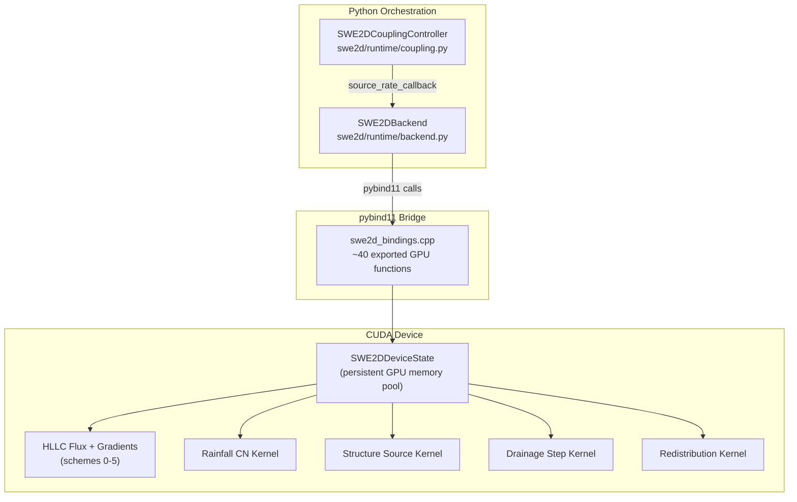
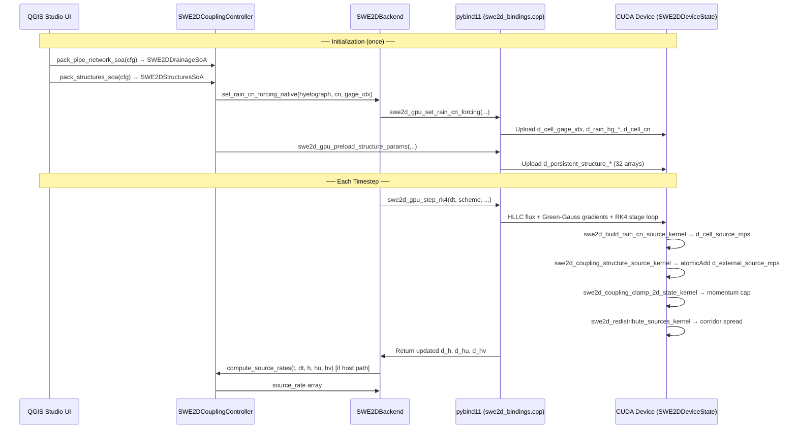

# SWE2D GPU Solver Architecture Report

> **Generated**: 2026-06-04  
> **Scope**: GPU solver core, rainfall/infiltration, hydraulic structures, urban drainage coupling  
> **Design philosophy**: GPU-only — all computation lives on CUDA device; no CPU fallback paths

---

## 1. Overview

The SWE2D GPU path is an HLLC finite-volume shallow-water solver with selectable higher-order spatial reconstruction (schemes 0–5) and multi-stage Runge-Kutta time integration (RK2/4/5/6). It is extended by three coupling submodules — rainfall infiltration, hydraulic structures, and 1D urban drainage networks — orchestrated through a single `SWE2DCouplingController`.



### 1.1 Key Design Decisions

- **GPU-only** — All computation is device-native. No CPU fallback paths exist. The GPU path drives all design decisions. AGENTS.md explicitly states: "Current SWE2D engineering priority is CUDA optimization and robustness hardening, not CPU parity."
- **Persistent device state** — `SWE2DDeviceState` holds all mesh topology, geometry, and BC data in device memory for the lifetime of a run, avoiding repeated H2D transfers.
- **SOA (Struct-of-Arrays) packing** — All coupling data (structures, drainage) is packed into flat numpy arrays before crossing the Python/C++ boundary, enabling efficient bulk GPU upload.
- **CUDA kernel graph caching** — When enabled, the entire flux+source kernel sequence for a given (mesh, scheme, integrator) triplet is captured into a `cudaGraphExec_t` for amortized launch overhead.

---

## 2. GPU Solver Core

### 2.1 Device Memory Pool (`SWE2DDeviceState`)

Defined in `cpp/src/swe2d_gpu.cuh`, the `SWE2DDeviceState` struct holds all persistent GPU allocations:

| Category | Fields | Description |
|---|---|---|
| **Mesh topology** | `d_edge_c0`, `d_edge_c1`, `d_edge_n0`, `d_edge_n1`, `d_edge_nx`, `d_edge_ny`, `d_edge_len` | Edge connectivity, normals, lengths |
| **Boundary conditions** | `d_edge_bc`, `d_edge_bc_val` | Per-edge BC type + forcing value |
| **Hydrographs** | `d_hg_edge_index`, `d_hg_offsets`, `d_hg_time_s`, `d_hg_value` | Time-series BC forcing, evaluated on-device |
| **Cell geometry** | `d_cell_zb`, `d_cell_area`, `d_n_mann_cell`, `d_cell_cx`, `d_cell_cy` | Bed elevation, area, Manning's n, centroids |
| **Conserved state** | `d_h`, `d_hu`, `d_hv` | Depth, x-momentum, y-momentum |
| **Gradients** (schemes ≥ 1) | `d_grad_hx`, `d_grad_hy`, `d_grad_hux`, `d_grad_huy`, `d_grad_hvx`, `d_grad_hvy` | Green-Gauss per-cell gradients |
| **RK stage buffers** | `d_h0`–`d_h3`, `d_hu0`–`d_hu3`, `d_hv0`–`d_hv3`, `d_k4_h`–`d_k6_h` | RK2/RK4/RK5/RK6 work arrays |
| **Flux accumulators** | `d_flux_h`, `d_flux_hu`, `d_flux_hv` | Zeroed each timestep |
| **CFL/diagnostics** | `d_lambda_max`, `d_active`, `d_n_wet` | Maximum wave speed, wet/dry mask |
| **Rainfall** | `d_cell_gage_idx`, `d_rain_hg_*`, `d_cell_source_mps`, `d_stage_cell_source_mps` | Rain infiltration source arrays |
| **Coupling** | `d_external_source_mps`, `d_persistent_structure_*`, `d_persistent_coupling_*` | Structure/drainage source injection buffers |

### 2.2 Spatial Schemes

Defined in `cpp/src/swe2d_solver.hpp`:

| Enum Value | Name | Reconstruction | Limiter |
|---|---|---|---|
| 0 | `FV_FIRST_ORDER` | None (piecewise-constant) | — |
| 1 | `FV_MUSCL_FAST` | Linear (gradient-based) | Superbee (TVD) |
| 2 | `FV_MUSCL_MINMOD` | Linear (gradient-based) | Minmod (robust, diffusive) |
| 3 | `FV_MUSCL_MC` | Linear (gradient-based) | Monotonized-Central |
| 4 | `FV_MUSCL_VAN_LEER` | Linear (gradient-based) | Van Leer (smooth TVD) |
| 5 | `FV_WENO3_LIKE` | Nonlinear blend (experimental) | WENO3-like weights |

Schemes 1–5 require Green-Gauss gradient computation on cell-centered data. The `hydrostatic_reconstruct_cuda_local()` kernel handles both TVD-limited linear reconstruction and WENO blending, then feeds reconstructed left/right states into the HLLC Riemann solver.

### 2.3 Time Integrators

All RK methods are GPU-native. The integrator order is selected at runtime:

- **RK2** (Heun's method): 2-stage, moderate CFL stability
- **RK4** (classical): 4-stage, high accuracy
- **RK5** (graph-safe): 5-stage, uses `d_k4_h` through `d_k6_h` for extra stage storage
- **RK6** (graph-safe): 6-stage, same extra stage buffer pattern

Graph-safe variants pre-allocate separate stage arrays (`d_k*_h`) rather than reusing in-place buffers, which is required for CUDA graph capture (no data-dependent aliasing).

### 2.4 CUDA Kernel Graph Caching

`KernelGraphCache` (in `swe2d_gpu.cuh`) captures the full kernel sequence for a given configuration:

```cpp
struct KernelGraphCache {
    cudaGraph_t     graph;
    cudaGraphExec_t exec;
    int32_t         n_cells, n_edges, spatial_scheme, time_integrator;
    int32_t         variant_key;       // encodes has_hydrograph + need_gradient
    uint64_t        config_signature;  // scalar/runtime config signature
    bool            is_valid;
};
```

When enabled via `swe2d_gpu_enable_kernel_graphs(dev, true)`, the first timestep captures the kernel sequence into a graph. Subsequent timesteps replay the `cudaGraphExec_t`, eliminating per-kernel launch overhead. The graph is invalidated (re-captured) on any mesh size or configuration change.

### 2.5 Potential Issues

| Issue | Severity | Detail |
|---|---|---|
| **Kernel graph staleness** | High | Graph captures kernel addresses at record time. A CUDA driver update, kernel recompile, or dynamic library reload can invalidate the exec without the `config_signature` detecting it. |
| **Dry/wet threshold sensitivity** | Medium | The `d_active` wet/dry mask uses a fixed depth threshold. Very shallow flows near this threshold can oscillate between active/inactive, causing flux discontinuities. |
| **Scheme 5 (WENO3-LIKE) experimental** | Medium | Marked as experimental in the enum. Nonlinear blending weights may produce unexpected behavior near discontinuities or on highly skewed unstructured meshes. |
| **Graph-safe higher-order BC snapshots** | Medium | Higher-order schemes use per-stage BC snapshots (`d_stage_edge_bc`, `d_stage_edge_bc_val`). These must be re-synchronized before capture if BC values change between graph recordings. |
| **Manning's n default** | Low | Default Manning roughness is applied per-cell; uninitialized cells may silently use 0.0, causing infinite wave speeds in the CFL condition. |

---

## 3. GPU Rainfall & Infiltration

### 3.1 Data Flow

```
Hyetograph (time-series rainfall depth)
    ↓
rainfall_hydrology.py: Hyetograph.depth_between_mm(t0, t1)
    ↓
swe2d/boundary_and_forcing/rainfall.py: SWE2DRainfallModule
    ↓
swe2d/runtime/backend.py: SWE2DBackend.set_rain_cn_forcing_native()
    └─ GPU path: swe2d_gpu.cu → swe2d_build_rain_cn_source_kernel()
        → d_cell_source_mps[n_cells]
    ↓
GPU timestep (RK2/RK4/RK5) with extreme_rain_mode subcycling
    ↓
Updated h (depth) via source term + flux integration
```

### 3.2 NRCS SCS Curve Number Infiltration

GPU implements NRCS SCS CN infiltration:

$$S = \frac{25400}{CN} - 254 \quad \text{[mm]}$$

$$I_a = 0.2 \cdot S$$

$$P_e = \begin{cases} 0 & P \leq I_a \\ \frac{(P - I_a)^2}{P + 0.8S} & P > I_a \end{cases}$$

The per-cell kernel `swe2d_build_rain_cn_source_kernel()` (line 1110 of `swe2d_gpu.cu`):
1. Interpolates rainfall at $t_0, t_1$ using gage-based time series (`d_rain_hg_*`)
2. Accumulates: $P = cumulative\_rain[c] + (R_1 - R_0)$
3. Applies SCS CN formula to compute excess precipitation $P_e$
4. Computes increment: $\Delta E = P_e - cumulative\_excess[c]$
5. Converts to depth rate: $\frac{\Delta E \cdot mm\_to\_model\_depth}{t_1 - t_0}$ [m/s]

### 3.3 Stage-Rate Evaluation

For multi-stage RK methods (RK4, RK5), the `swe2d_eval_rain_cn_stage_rate_kernel()` computes the instantaneous rainfall rate at each stage's intermediate time level, using the derivative $\frac{dP_e}{dP} \cdot \frac{dR}{dt}$ to avoid re-applying the full cumulative CN formula per stage.

### 3.4 Extreme-Rain Subcycling

When `extreme_rain_mode` is enabled, the GPU solver performs subcycling on the rainfall source term within each main timestep. Configuration parameters:

| Parameter | Default | Description |
|---|---|---|
| `source_cfl_beta` | 0.5 | CFL safety factor for source subcycling |
| `source_max_substeps` | 16 | Maximum rain subcycles per main step |
| `source_rate_cap` | — | Maximum allowed source depth rate [m/s] |
| `source_depth_step_cap` | — | Maximum depth increase per substep [m] |
| `source_true_subcycling` | `False` | Independent rain subcycling vs. tied to flux CFL |
| `source_imex_split` | `False` | IMEX splitting for stiff source terms |

The `swe2d_stage_source_max_kernel()` computes the maximum source rate across all RK stages to determine the required sub-step count for stability.

### 3.5 Potential Issues

| Issue | Severity | Detail |
|---|---|---|
| **`RainfallSourceEngine` is a skeleton** | High | `swe2d/boundary_and_forcing/rainfall.py` contains `TODO: gauge interp, rasters`. The `sample_cell_rain()` method is not yet implemented, so spatially-distributed rainfall (raster-based, gauge interpolation) is not available on the GPU path. |
| **CN=0 edge case** | Medium | $CN = 0$ produces $S = \infty$, causing division by zero or overflow. No guard clamps CN to a minimum (e.g., 30). |
| **Extreme-rain subcycling stability** | Medium | High `source_rate_cap` values combined with low `source_cfl_beta` can produce very large substep counts, potentially exceeding `source_max_substeps` and causing mass conservation errors. |
| **Stage-rate derivative accuracy** | Low | The $\frac{dP_e}{dP}$ approximation in `swe2d_eval_rain_cn_stage_rate_kernel` assumes smooth cumulative rainfall. Discontinuous hyetographs (e.g., burst storms) can cause derivative spikes. |

---

## 4. Structures Coupling

### 4.1 Structure Types

Defined in `swe2d/extensions/extension_models.py`:

| Enum Value | Type | Flow Model |
|---|---|---|
| `CULVERT` | Culvert | Inlet/outlet control (FHWA HEC-5), 58 culvert codes |
| `WEIR` | Weir | $Q = C_d B \sqrt{2g h^3}$ (submerged/unsubmerged) |
| `GATE` | Gate | Orifice flow through opening |
| `BRIDGE` | Bridge | Deck obstruction + underdeck loss-based damping |
| `PUMP` | Pump | Fixed Q or variable per head |

### 4.2 Data Flow

```
User Input (QGIS layers / GeoPackage)
    ↓
swe2d/extensions/structures.py: SWE2DStructureModule
    ├─ Reads HydraulicStructureConfig from layer features
    └─ structure_flows(cell_wse) → per-structure Q [m³/s]
    ↓
swe2d/runtime/coupling.py: SWE2DCouplingController
    ├─ pack_structures_soa() → SWE2DStructuresSoA (32 flat numpy arrays)
    └─ _native_structure_flows() → swe2d_gpu_compute_structure_flows()
    ↓
pybind11: swe2d_gpu_compute_coupling_full_on_device(...) [persistent path]
    ↓
GPU: swe2d_coupling_structure_source_kernel
    ├─ atomicAdd(d_external_source_mps[up_cell],  +Q / area)
    └─ atomicAdd(d_external_source_mps[dn_cell],  -Q / area)
    ↓
GPU: swe2d_redistribute_sources_kernel (optional corridor redistribution)
    └─ Reverse single-cell injection → spread across influence corridor
    ↓
GPU: swe2d_coupling_clamp_2d_state_kernel (momentum cap)
    └─ Limit |u|, |v| to prevent velocity jets
```

### 4.3 SOA Packing (`SWE2DStructuresSoA`)

The `pack_structures_soa()` function in `coupling.py` converts `HydraulicStructureConfig` into 32 flat numpy arrays:

| Array | Type | Example Fields |
|---|---|---|
| Core | `int32/float64` | `structure_type`, `upstream_cell`, `downstream_cell`, `crest_elev`, `width`, `height`, `diameter`, `length` |
| Hydraulics | `float64` | `roughness_n`, `coeff`, `cd`, `opening`, `q_pump`, `max_flow` |
| Culvert-specific | `int32/float64` | `culvert_code` (FHWA HEC-5), `culvert_shape` (0=circular, 1=box), `culvert_rise`, `culvert_span`, `culvert_area_m2`, `culvert_barrels`, `culvert_slope` |
| Inlet/Outlet | `float64` | `inlet_invert_elev`, `outlet_invert_elev`, `entrance_loss_k`, `exit_loss_k` |
| Embankment | `int32/float64` | `embankment_enabled`, `embankment_crest_elev`, `embankment_overflow_width`, `embankment_weir_coeff` |

All dimensional fields are packed in **feet** (USC units), converted from model units via `model_to_ft` factor. This is because the `culvert_routine.py` backend uses FHWA HEC-5 equations which are defined in imperial units.

### 4.4 Persistent On-Device Fast Path

`apply_native_device_sources()` in the coupling controller provides a zero-host-readback path:

1. `swe2d_gpu_set_coupling_device_global(dev_ptr)` — Register the `SWE2DDeviceState` pointer
2. `swe2d_gpu_preload_structure_params(...)` — Upload all structure data once to persistent GPU buffers
3. `swe2d_gpu_preload_coupling_cell_area(cell_area)` — Upload cell areas to `d_persistent_coupling_cell_area`
4. `swe2d_gpu_compute_coupling_full_on_device(...)` — Each timestep: read `d_h`, `d_cell_zb` from device, compute flows, atomic-inject into `d_external_source_mps` — all on GPU, no host readback
5. `swe2d_gpu_redistribute_structure_sources_persistent(...)` — Optional on-device redistribution

**Constraint**: This path is only active when `coupling_loop == "cuda"` AND drainage is `None` AND no bridge structures are enabled.

### 4.5 Corridor Redistribution

Without redistribution, structure flows are injected as point sources at single-cell up/down indices, creating velocity jets. The redistribution kernel in `cpp/src/swe2d_gpu_redistribute.cu`:

1. Reverses the single-cell `atomicAdd` for each structure
2. Normalizes pre-computed corridor weights (`dist_weights[]`)
3. Redistributes signed flow across all corridor cells proportionally

Corridor cells are computed in `_build_redistribution_data()` using a perpendicular distance threshold (`influence_width_m`) from the structure axis line. Weights are currently uniform (all 1.0).

### 4.6 Culvert Table Lookup Mode

Culvert solver mode 1 pre-computes $Q(h_w, t_w)$ lookup tables on GPU via `swe2d_gpu_build_culvert_tables()`:

- Resolution: `n_hw × n_tw` (default 32×16, configurable via `BACKWATER_SWE2D_CULVERT_TABLE_N_HW` / `_N_TW`)
- At runtime, GPU texture/bilinear interpolation replaces iterative secant root-finding (mode 0)

### 4.7 Bridge Stacked Coupling

Bridges use a stratified mesh approach (`swe2d/runtime/bridge_stacked_runtime.py`):

- `BridgeStackedPlan` groups cells by `layer_role`: 0=underdeck, 1=deck, 2=overdeck
- `bridge_stacked_source_scale()` computes product of `opening_fraction × layer_scale`
- `apply_bridge_stacked_phase3_source_weight()` preserves global flow conservation while distributing to downstream (positive Q) and upstream (negative Q) corridors
- Bridge stacked coupling mode is selected via `bridge_stacked_coupling_mode` (`legacy_scalar` vs `phase3_spatial`)

### 4.8 Potential Issues

| Issue | Severity | Detail |
|---|---|---|
| **atomicAdd contention** | High | Without redistribution, multiple structures injecting into the same cell produce serialized atomic operations. On large meshes with many co-located structures, this can bottleneck the kernel. |
| **Unit system foot-vs-meter sensitivity** | High | Structure metadata is packed in feet but cell data is in model units. The `model_to_ft` conversion chain (`pack_structures_soa` → `_native_structure_flows` → SI back-conversion) has multiple conversion points. A single missed conversion produces silent flow errors. |
| **Momentum cap heuristics** | Medium | `swe2d_coupling_clamp_2d_state_kernel` uses `momentum_cap_min_speed` and `momentum_cap_celerity_mult` to limit post-coupling velocities. These are empirical parameters tuned for specific mesh resolutions — wrong values can either fail to prevent jets or over-dampen legitimate flows. |
| **Culvert outlet-control by-pass** | Medium | Outlet control in `culvert_routine.py` uses a direct-step energy method. On GPU (mode 0), this is computed on the host. On GPU (mode 1, table lookup), outlet control is approximated by Q-table interpolation, which can diverge from the full energy solution for long culverts. |
| **Embankment weir overflow** | Low | Embankment overflow uses a weir coefficient defaulting to 1.7 (SI). Road-overtopping flows can be very sensitive to this coefficient; the default may not be appropriate for all embankment geometries. |

---

## 5. Drainage Network Coupling

### 5.1 Network Topology

The 1D pipe network is defined in `swe2d/extensions/extension_models.py` via `PipeNetworkConfig`:

| Element | Role |
|---|---|
| **Node** (`DrainageNode`) | Junction with invert elevation, max depth, surface area |
| **Link** (`DrainageLink`) | Pipe connecting two nodes (length, diameter, roughness n) |
| **Inlet** (`InletExchange`) | Surface capture: 2D cell → network node (crest elev, width, coefficient) |
| **Outfall** (`OutfallExchange`) | Network discharge: node → 2D cell (invert elev, diameter, coefficient) |
| **Pipe End** (`PipeEndExchange`) | Pipe termination exchange with 2D surface (bidirectional, with loss coefficients) |

### 5.2 Solver Modes

| Mode | Name | Equation | Use Case |
|---|---|---|---|
| 0 | **EGL** | $\Delta H = Q^2 \left[\frac{n^2 L}{A^2 R_h^{4/3}} + \frac{K_e+K_o}{2gA^2}\right]$ | Pressurized storm drains |
| 1 | **Diffusion** | $Q = \frac{1}{n} A R_h^{2/3} \sqrt{S_w}$ | Gravity sewers, open channels |
| 2 | **Dynamic** | $Q^{n+1} = \frac{Q^n + \Delta t \, g A \, \frac{\Delta H}{L}}{1 + \Delta t \, g n^2 \lvert Q^n \rvert / (A R_h^{4/3})}$ | Surge, bore propagation |

Outfall modes: `free` (unrestricted drain), `fixed_wse` (prescribed tailwater), `stage_discharge` (rating curve).

### 5.3 SOA Packing (`SWE2DDrainageSoA`)

`pack_pipe_network_soa()` in `coupling.py` converts `PipeNetworkConfig` into ~30 flat numpy arrays:

| Category | Arrays |
|---|---|
| Nodes | `node_x`, `node_y`, `node_invert_elev`, `node_max_depth`, `node_surface_area` |
| Links | `link_from`, `link_to`, `link_length`, `link_roughness_n`, `link_diameter`, `link_max_flow`, `link_cd` |
| Inlets | `inlet_cell`, `inlet_node`, `inlet_crest_elev`, `inlet_width`, `inlet_coefficient`, `inlet_max_capture` |
| Outfalls | `outfall_cell`, `outfall_node`, `outfall_invert_elev`, `outfall_diameter`, `outfall_coefficient`, `outfall_max_flow`, `outfall_zero_storage` |
| Pipe Ends | `pipe_end_cell`, `pipe_end_node`, `pipe_end_invert_elev`, `pipe_end_diameter`, `pipe_end_area`, `pipe_end_inlet_loss_k`, `pipe_end_outlet_loss_k` |

The `solver_mode` integer (0/1/2) is stored as a scalar.

### 5.4 GPU Kernels

All in `cpp/src/swe2d_gpu.cu`:

| Kernel | Line | Function |
|---|---|---|
| `swe2d_drainage_node_update_kernel` | 3380 | Continuity: $h^{n+1} = h^n + \Delta t \cdot \sum Q_{net} / A_{surface}$, clamped to $[0, h_{max}]$ |
| `swe2d_drainage_pipe_end_qleave_kernel` | 3398 | Accumulate link flows into node $Q_{leave}$ with sign convention |
| `swe2d_drainage_pipe_end_bc_kernel` | ~3420 | Compute pipe-end boundary depth from 2D WSE with entrance/exit losses: $\text{WSE}_{eff} = \max(z_{inv}, \text{WSE}_{2D} - K \cdot v^2/2g)$ |
| `swe2d_drainage_pipe_end_exchange_kernel` | ~3500 | Exchange flow between 2D cells and pipe-end nodes with volume limiting |
| `swe2d_drainage_apply_delta_kernel` | 3723 | Apply per-cell source deltas from drainage to `d_external_source_mps` |

### 5.5 `swe2d_gpu_drainage_step` Binding

Exported from `swe2d_bindings.cpp` (line 1662), this is a headless 1D drainage network step that:
1. Reads `d_h`, `d_cell_zb` from device to compute 2D WSE
2. Runs all drainage kernels (node update → pipe end BC → exchange → apply delta)
3. Returns updated `node_depth`, `link_flow`, and `q_cell` arrays

When `drainage_solver_backend == "gpu"`, the `SWE2DCouplingController` manages persistent `_gpu_node_depth` and `_gpu_link_flow` state arrays that are synced to/from the drainage module's Python state dict.

### 5.6 Potential Issues

| Issue | Severity | Detail |
|---|---|---|
| **Dynamic mode stiffness** | High | Mode 2 uses a semi-implicit update that can become unstable for surcharged pipes with small $\Delta t$. The explicit denominator $1 + \Delta t \, g n^2 |Q| / (A R_h^{4/3})$ can approach 1.0 for large $Q$, losing the stabilizing effect. |
| **Outfall zero-storage mass conservation** | Medium | `outfall_zero_storage=1` nodes act as instantaneous sinks — all incoming flow is discharged with no storage. If the receiving 2D cell is dry or has insufficient capacity, mass is silently lost. |
| **Pipe-end loss coefficient defaults** | Medium | `pipe_end_inlet_loss_k` defaults to 0.5 and `pipe_end_outlet_loss_k` defaults to 1.0. These are reasonable for square-edged entrances/exits but are wrong for rounded, flared, or projecting inlets. No warning when defaults are used. |
| **Node surface area default** | Low | `node_surface_area` defaults to 50 m² when not specified in metadata. For large junction boxes or storage nodes, this underestimates storage and overestimates depth changes. |
| **No variable timestep for drainage** | Low | The drainage network uses the same $\Delta t$ as the 2D solver. For networks with very short pipes, the CFL condition for dynamic mode may require smaller $\Delta t$ than the 2D domain. |

---

## 6. Coupling Orchestrator

### 6.1 `SWE2DCouplingController`

Located in `swe2d/runtime/coupling.py` (line ~420). This class is the single entry point for all coupling computations:

```python
class SWE2DCouplingController:
    def __init__(
        self,
        cell_area, cell_bed,
        drainage: Optional[SWE2DUrbanDrainageModule] = None,
        structures: Optional[SWE2DStructureModule] = None,
        coupling_loop: str = "cuda",               # always "cuda"
        drainage_solver_backend: str = "gpu",       # always "gpu"
        drainage_gpu_method: str = "step",          # "step" | "iterative"
        culvert_solver_mode: int = 0,               # 0=secant, 1=table
        bridge_cuda_coupling: bool = False,
        bridge_stacked_coupling_mode: str = "phase3_spatial",
        ...
    ):
```

### 6.2 GPU Dispatch

```
compute_source_rates(t_s, dt_s, h, hu, hv)
    │
    └─ coupling_loop == "cuda"
        └─ _compute_source_rates_cuda()
            ├─ apply_native_device_sources() → persistent on-device (if eligible)
            └─ OR fallback: host WSE read → GPU structure_flows → source injection
```

### 6.3 Persistent On-Device Fast Path

`apply_native_device_sources()` provides the fastest path — zero host-device transfers for source computation. It is gated by strict eligibility:

```python
if self.coupling_loop != "cuda":       return False  # must be CUDA
if self.structures is None:            return False  # need structures
if self.drainage is not None:          return False  # no drainage on-device
if self._has_enabled_bridge_structures: return False  # no bridges on-device
```

When eligible, the path:
1. Pre-loads all structure params + cell areas to persistent GPU buffers (once)
2. Each timestep: `swe2d_gpu_compute_coupling_full_on_device()` reads `d_h`, `d_cell_zb` on-device, computes structure flows, atomically injects into `d_external_source_mps`
3. Optionally applies on-device redistribution via `swe2d_gpu_redistribute_structure_sources_persistent()`

### 6.4 Momentum Clamping

After coupling source injection, `swe2d_coupling_clamp_2d_state_kernel` (line 9000 of `swe2d_gpu.cu`) limits velocity magnitudes to prevent instabilities:

$$|u|_{max} = \max(v_{min}, c_{mult} \cdot \sqrt{g h})$$

Where $v_{min}$ is `momentum_cap_min_speed` and $c_{mult}$ is `momentum_cap_celerity_mult`. Velocities exceeding the cap are scaled down proportionally.

### 6.5 Diagnostics

`SWE2DCouplingDiagnostics` is populated each step:

| Field | Source |
|---|---|
| `drainage_max_node_depth` | Max depth across all network nodes |
| `drainage_max_link_flow` | Max absolute flow across all pipes |
| `structure_total_flow` | Sum of absolute structure flows |
| `source_sum/min/max` | Aggregate statistics of the per-cell source rate array |
| `component_sums` | Dict with per-module source sums (drainage, structures) |

### 6.6 Potential Issues

| Issue | Severity | Detail |
|---|---|---|
| **Drainage/structures time-step mismatch** | Medium | The coupling controller uses the 2D solver's $\Delta t$. If the drainage network needs a smaller $\Delta t$ (e.g., dynamic mode with short pipes), it is substepped inside `drainage.solve_network_step()`, but this internal substepping is opaque to the GPU path. |
| **Cell-area division by zero** | Low | Source rate computation divides structure flow by `cell_area[cell]`. Cells with zero or NaN area produce infinite/NaN source rates. There is a `max(area, 1e-12)` guard in redistribution but not in all paths. |
| **Bridge + non-bridge flow ordering** | Low | The `compute_source_rates` method applies drainage sources first, then structures. If a bridge and a culvert share an upstream cell, the order of `np.add.at` accumulation matters for redistribution but is not explicitly ordered. |
| **Stale `__pycache__` across coupling module boundaries** | High | The coupling controller crosses many module boundaries (`coupling.py` → `backend.py` → `bindings.cpp`). Stale `.pyc` files cause invisible failures (wrong arity, missing attributes, silent fallback) that are not caught by normal error handling. After any structural change to a Python module, purge `__pycache__` before restarting QGIS. |

---

## 7. End-to-End Data Flow Summary



### Key Data Conversions

| Stage | Units | Notes |
|---|---|---|
| User input (UI) | Model units (ft or m) | Determined by CRS |
| `pack_structures_soa()` | Feet (USC) | Converted via `model_to_ft` factor |
| `swe2d_gpu_compute_structure_flows()` | Feet internally; returns SI (m³/s) | In-kernel conversion |
| `_structure_source_rate_from_flows()` | SI → model units | Converts m³/s back to model-length³/s |
| `SWE2DDeviceState` arrays | Model units | Consistent with mesh geometry |
| Rainfall accumulators | mm → model depth | `mm_to_model_depth` conversion factor |

---

## 8. Key Files Reference

### GPU Solver Core

| File | Role |
|---|---|
| `cpp/src/swe2d_gpu.cu` | All CUDA kernels: HLLC flux, gradients, rainfall, structures, drainage, clamping |
| `cpp/src/swe2d_gpu.cuh` | `SWE2DDeviceState`, `KernelGraphCache`, host-callable API declarations, SWE3D structs |
| `cpp/src/swe2d_gpu_redistribute.cu` | `swe2d_redistribute_sources_kernel` — structure source corridor redistribution |
| `cpp/src/swe2d_solver.hpp` | `SWE2DSpatialScheme` enum (0–5), `SWE2DSolver` struct with rainfall arrays |
| `cpp/src/swe2d_mesh.hpp` | Mesh topology structs (edges, cells, adjacency) |
| `cpp/src/swe2d_bindings.cpp` | pybind11 module: ~40 exported GPU functions |

### Rainfall & Infiltration

| File | Role |
|---|---|
| `rainfall_hydrology.py` | `Hyetograph` piecewise-linear cumulative rainfall, `build_hyetograph()` parser |
| `swe2d/boundary_and_forcing/rainfall.py` | `SWE2DRainfallModule` — solver adapter for rainfall sources |
| `swe2d/extensions/extension_models.py` | `RainFieldConfig`, `RainfallSourceEngine` (skeleton), CN defaults |
| `swe2d/runtime/backend.py` | `SWE2DBackend.set_rain_cn_forcing_native()` — GPU CN setup |

### Structures

| File | Role |
|---|---|
| `swe2d/extensions/extension_models.py` | `StructureType` enum, `HydraulicStructure`, `HydraulicStructureConfig`, `HydraulicStructureEngine` |
| `swe2d/extensions/structures.py` | `SWE2DStructureModule` — weir/orifice/culvert flow dispatch, Python structure solver |
| `culvert_routine.py` | FHWA HEC-5 culvert hydraulics: inlet/outlet control, 58 culvert codes, circular/rectangular cross-sections |
| `swe2d/runtime/bridge_stacked_runtime.py` | Bridge stacked mesh: `BridgeStackedPlan`, phase3 spatial redistribution, `bridge_stacked_source_scale()` |

### Drainage Network

| File | Role |
|---|---|
| `swe2d/extensions/extension_models.py` | `DrainageSolverMode` enum (0–2), `PipeNetworkConfig`, `DrainageNode/Link/InletExchange/OutfallExchange/PipeEndExchange` |
| `swe2d/extensions/drainage_network.py` | `SWE2DUrbanDrainageModule` — EGL/diffusion/dynamic solver, surface exchange, node/link state management |

### Coupling Orchestration

| File | Role |
|---|---|
| `swe2d/runtime/coupling.py` | `SWE2DCouplingController`, `SWE2DCouplingSoA`, `SWE2DStructuresSoA`, `SWE2DDrainageSoA`, `pack_*_soa()` functions, `SWE2DCouplingDiagnostics` |

### QGIS Studio UI (current architecture)

| File | Role |
|---|---|
| `swe2d/workbench/studio_dialog.py` | Main `SWE2DWorkbenchStudioDialog` — programmatic QMainWindow + dock + toolbar construction |
| `swe2d/workbench/views/` | View-layer modules: `model_tab_view.py`, `map_tab_view.py`, `topology_tab_view.py`, `results_view.py`, `studio_host_methods.py`, etc. |
| `swe2d/workbench/controllers/` | Controller-layer modules: `run_controller.py`, `mesh_controller.py`, `workbench_controller.py`, `layer_controller.py`, etc. |
| `swe2d/workbench/workbench.py` | Plugin initialization and iface integration |

### Other

| File | Role |
|---|---|
| `swe2d/runtime/backend.py` | `SWE2DBackend` — unified Python interface to native solver |
| `swe2d/runtime/non_gui_runtime.py` | GPU-agnostic solver loop (used by headless/CLI runs) |
| `native_backend.py` | Optional CPU acceleration for 1D unsteady (not 2D GPU) |
| `swe3d_geometry_ingest.py` | OBJ parsing + fractional cut-cell porosity for 3D obstacles |
| `stacked_bridge_coupling.py` | Empirical deck-entry/exit loss laws for toy bridge model |
| `stacked_bridge_toy.py` | Prototype 2D implicit Poisson bridge solver |

### Documentation

| File | Role |
|---|---|
| `AGENTS.md` | GPU validation priority, Godunov rollout handoff, `__pycache__` discipline |
| `docs/GODUNOV_2D_GPU_IMPLEMENTATION_GUIDE.md` | Godunov FVM rollout implementation guide |
| `docs/SOLVER_ORDER_AND_STENCIL.md` | Stencil and order-of-accuracy details |
